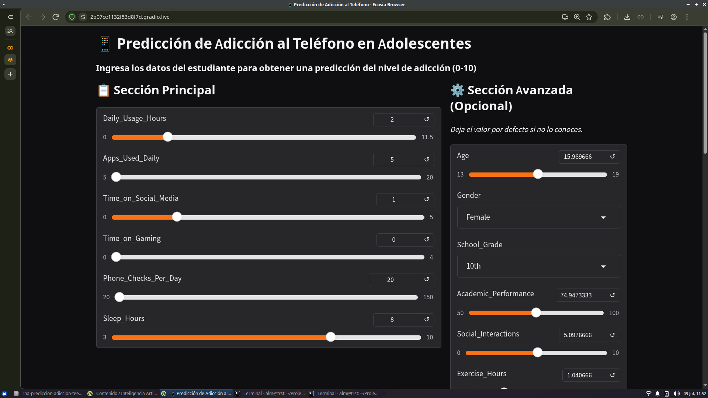
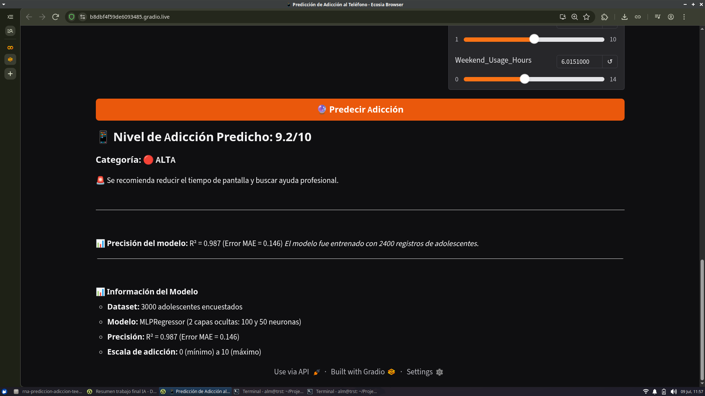

# 📱 Predicción de Adicción al Teléfono con Redes Neuronales (RNA)

> Proyecto final para el curso **1ASI0404 – Inteligencia Artificial**  
> Ciclo 2026-1 | Prof. Andres Gibu La Torre

## 📋 Descripción

Este proyecto implementa un sistema basado en **Redes Neuronales Artificiales (RNA)** para predecir el nivel de adicción al teléfono inteligente en adolescentes, utilizando un conjunto de datos real de Kaggle. La aplicación ofrece una interfaz web interactiva construida con **Gradio**, donde el usuario ingresa información sobre hábitos de uso, salud mental y estilo de vida, y obtiene una predicción numérica (escala 0–10) junto con una interpretación cualitativa.

## 🎯 Objetivo

- Aplicar técnicas de **Inteligencia Artificial moderna** (RNA) a un problema del mundo real.
- Construir un modelo predictivo con **MLPRegressor** (Perceptrón Multicapa) de scikit‑learn.
- Desplegar el modelo en una **interfaz gráfica** fácil de usar.
- Reflexionar sobre los **principios éticos** en el uso de IA para salud mental.

## 🧠 Modelo

- **Algoritmo:** `MLPRegressor` (Red Neuronal Multicapa)
- **Arquitectura:** 2 capas ocultas (100 y 50 neuronas) con activación ReLU
- **Optimizador:** Adam
- **Preprocesamiento:** Escalado con `StandardScaler`, codificación de variables categóricas
- **Rendimiento:**  
  - R² ≈ 0.987  
  - MAE ≈ 0.146 (en escala 0–10)

## 📊 Dataset

- **Fuente:** [Teen Phone Addiction and Lifestyle Survey – Kaggle](https://www.kaggle.com/datasets/khushikyad001/teen-phone-addiction-and-lifestyle-survey)
- **Registros:** 2,933 adolescentes
- **Variables:** 25 (demográficas, hábitos de uso, salud mental, control parental, etc.)
- **Objetivo:** `Addiction_Level` (valor continuo entre 0 y 10)

## 🛠️ Tecnologías y herramientas

- **Python 3.12+** (entorno manejado con [`uv`](https://github.com/astral-sh/uv))
- **scikit‑learn** – modelo RNA y preprocesamiento
- **Gradio** – interfaz web interactiva
- **Pandas / NumPy** – manipulación de datos
- **Matplotlib / Seaborn** – visualización y EDA (en notebook)
- **Jupyter / Google Colab** – análisis exploratorio

---

## ⚙️ Instalación y ejecución (con `uv`)

> `uv` es un gestor de paquetes y entornos extremadamente rápido, alternativo a `pip` + `venv`.  
> Si no lo tienes instalado, hazlo con: `curl -LsSf https://astral.sh/uv/install.sh | sh`

### 1. Clonar el repositorio

```bash
git clone https://github.com/tu-usuario/rna-prediccion-adiccion-teen.git
cd rna-prediccion-adiccion-teen
```

### 2. Sincronizar el entorno virtual (instala todas las dependencias)

```bash
uv sync
```

Este comando crea automáticamente un entorno virtual (`.venv`) e instala las dependencias definidas en `pyproject.toml` y `uv.lock`.

### 3. Activar el entorno virtual (opcional, pero recomendado)

```bash
source .venv/bin/activate      # Linux / macOS
# o
.venv\Scripts\activate         # Windows (PowerShell)
```

### 4. Ejecutar la aplicación

```bash
uv run src/app.py
```

O bien, si ya activaste el entorno:

```bash
python src/app.py
```

Al ejecutarlo, aparecerán dos enlaces:

Local: `http://127.0.0.1:7860`

Público (temporal): `https://xxxx.gradio.live` (compartir para la presentación)

### 5. (Opcional) Abrir el notebook de análisis exploratorio
Si prefieres ejecutar el EDA en local:

```bash
uv run jupyter notebook notebooks/eda_analysis.ipynb
```

O desde Google Colab, abre el enlace que está en `link_eda_analysis_google_colab.txt`.

## 📁 Estructura del proyecto

```
.
├── dataset/
│   └── teen_phone_addiction.csv   # Datos originales
├── images/                        # Capturas para el README
│   ├── formulario.png             # Formulario de entrada
│   └── resultado.png              # Resultado de la predicción
├── notebooks/
│   ├── eda_analysis.ipynb         # Análisis exploratorio
│   └── mlp_confusion_matrix.ipynb # Análisis de la red neuronal
│   └── linear_regression_coefficients.ipynb # Comparativa de coeficientes
├── report/
│   └── TF_Informe_Almeida.docx    # Informe en formato .docx
│   └── TF_Informe_Almeida.md      # Informe en formato .md
│   └── TF_Informe_Almeida.pdf     # Informe en formato .pdf
├── src/
│   └── app.py                     # Código principal de la interfaz y modelo
├── pyproject.toml                 # Configuración del proyecto y dependencias
├── uv.lock                        # Bloqueo exacto de versiones (uv)
└── README.md                      # Este archivo
```

## 🖥️ Capturas de pantalla

*Formulario dividido en sección principal (obligatoria) y avanzada (opcional).*


*Ejemplo de salida con nivel de adicción, categoría y recomendación.*

## 🔍 Análisis exploratorio (EDA) – Hallazgos clave

Del análisis de correlación se identificaron las variables más influyentes:

|Variable	| Correlación con Addiction_Level|
|:--|--:|
|Daily_Usage_Hours |	0.601|
|Apps_Used_Daily |	0.319|
|Time_on_Social_Media |	0.307|
|Time_on_Gaming |	0.273|
|Phone_Checks_Per_Day |	0.246|
|Sleep_Hours |	-0.217 (correlación negativa)|

Esto justifica la elección de las variables principales en el formulario.

## 🧪 Resultados del modelo

|Métrica |	Valor|
|:--|--:|
|R² |	0.987|
|MAE |	0.146|

El modelo explica aproximadamente el **98.7%** de la varianza del nivel de adicción, con un error promedio de solo **0.15 puntos** en la escala de 0 a 10.

## ⚖️ Consideraciones éticas

* El sistema no almacena datos personales ni comparte información con terceros.
* Todas las variables utilizadas son auto-reportadas y anónimas.
* La predicción es una herramienta de apoyo, no un diagnóstico clínico.
* No se utilizan variables sensibles como etnia, religión u orientación sexual.
* El objetivo es concientizar y fomentar hábitos saludables, no estigmatizar.

## 🚀 Mejoras futuras

* Incorporar series temporales para predecir evolución de la adicción.
* Probar arquitecturas más profundas (ej. redes con dropout) para generalizar mejor.
* Desplegar en Hugging Face Spaces con gradio deploy para acceso permanente.

## 👤 Autor

Almeida Aguilar, Ivan Antonio – u20231b249 – u20231b249@upc.edu.pe

## 📚 Curso

1ASI0404 – Inteligencia Artificial

Prof. Andres Gibu La Torre

Sección: 6392 – Ciclo 2026-1

## 📄 Licencia

Este proyecto fue desarrollado con fines académicos. Todos los derechos reservados.
